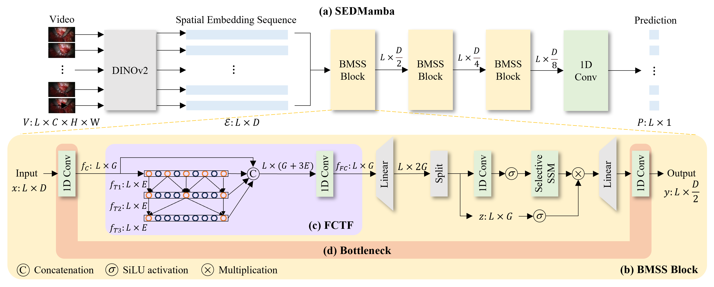

# SEDMamba: Enhancing Selective State Space Modelling with Bottleneck Mechanism and Fine-to-Coarse Temporal Fusion for Efficient Error Detection in Robot-Assisted Surgery
This repository contains the official PyTorch implementation of the paper:
> [**SEDMamba: Enhancing Selective State Space Modelling with Bottleneck Mechanism and Fine-to-Coarse Temporal Fusion for Efficient Error Detection in Robot-Assisted Surgery**](https://doi.org/10.1109/LRA.2024.3505818)<br>
> [Jialang Xu](https://www.linkedin.com/in/jialang-xu-778952257/), Nazir Sirajudeen, Matthew Boal, Nader Francis, Danail Stoyanov, Evangelos B. Mazomenos

## Updates
**[2024-12-09]** Released error annotations for SAR-RARP50.  
**[2024-11-29]** Released SEDMamba code with a demo.

## Introduction
Automated detection of surgical errors can improve robotic-assisted surgery. Despite promising progress, existing methods still face challenges in capturing rich temporal context to establish long-term dependencies while maintaining computational efficiency. In this paper, we propose a novel hierarchical model named SEDMamba, which incorporates the selective state space model (SSM) into surgical error detection, facilitating efficient long sequence modelling with linear complexity. SEDMamba enhances selective SSM with a bottleneck mechanism and fine-to-coarse temporal fusion (FCTF) to detect and temporally localize surgical errors in long videos. The bottleneck mechanism compresses and restores features within their spatial dimension, thereby reducing computational complexity. FCTF utilizes multiple dilated 1D convolutional layers to merge temporal information across diverse scale ranges, accommodating errors of varying duration. Our work also contributes the first-of-its-kind, frame-level, in-vivo surgical error dataset to support error detection in real surgical cases. Specifically, we deploy the clinically validated observational clinical human reliability assessment tool (OCHRA) to annotate the errors during suturing tasks in an open-source radical prostatectomy dataset (SAR-RARP50). Experimental results demonstrate that our SEDMamba outperforms state-of-the-art methods with at least 1.82% AUC and 3.80% AP performance gains with significantly reduced computational complexity.

## Architecture


Fig.1 The pipeline of the proposed SEDMamba. (a) The overall architecture of SEDMamba. (b) The fundamental block of SEDMamba, namely the bottleneck
 multi-scale state space (BMSS) block; (c) Fine-to-coarse temporal fusion (FCTF); (d) Bottleneck mechanism.

## Setup & Usage for the Code
### SAR-RARP50 Dataset with Error Annotations
1. Clone the repository:
```bash
git clone https://github.com/wzjialang/SEDMamba.git
```

2. Download error annotation dataset [here](https://doi.org/10.5522/04/27992702) and unzip it under `./data` folder:
```bash
cd SEDMamba
unzip unzip error_annotation_SAR-RARP50.zip -d ./data
```

The structure of data folders:
 ```
(root folder)
├── SEDMamba
|  ├── data
|  |  ├── train_emb_DINOv2
|  |  |  ├── video_1.pkl
|  |  |  ├── ...
|  |  ├── test_emb_DINOv2
|  |  |  ├── video_41.pkl
|  |  |  ├── ...
|  ├── baseline
|  ├── ...
```
Each .pkl file is a dictionary with the following keys:
- 'feature': spatial embedding sequence (5Hz) extracted using [DINOv2](https://github.com/facebookresearch/dinov2).
Shape: [video_length, feature_dimension]
- 'error_GT': binary error annotations on frame level (5Hz), `0` means normal, `1` means error. Shape: [video_length]
- 'image_name': corresponding frame names. Shape: [video_length]

### Install dependencies:
Ensure you have the following dependencies:
```
- mamba-ssm
- Python 3.9+
- PyTorch 1.12+
- CUDA 11.6+
```

- Example Installation
```bash
conda create -n sedmamba python=3.9
conda activate sedmamba
conda install pytorch==2.4.0 torchvision==0.19.0 torchaudio==2.4.0  pytorch-cuda=11.8 -c pytorch -c nvidia
pip install mamba-ssm
pip install mamba-ssm[causal-conv1d]
pip install mamba-ssm[dev]
```

### Inference & Visualization & Train
#### Inference SEDMamba model:
```bash
python inference.py -exp Inference_SEDMamba -dp ./data -cls 1 -gpu_id cuda:0 -w 4 -weight ./weight/SEDMamba.pth
```
- `-exp`: experiment name
- `-dp`: dataset path
- `-cls`: class number (`1` for binary classification)
- `-gpu_id`: single gpu id
- `-w`: number of workers
- `-weight`: model weight path

#### Visualization results:
```bash
python visualization.py -lp ./exp_log/0.0001/Inference_SEDMamba -rp ./exp_log/0.0001/Inference_SEDMamba -sp ./exp_log/0.0001/Inference_SEDMamba
```
- `-lp`: ground truth path
- `-rp`: prediction result path
- `-sp`: visualization saving path

#### Train SEDMamba model:
```bash
python train.py -exp SEDMamba -dp ./data -e 200 -l 1e-4 -cls 1 -gpu_id cuda:0 -w 4 -s 2
```
- `-e`: epochs
- `-l`: learning rate
- `-s`: random seed

## Acknowledge
We sincerely appreciate the authors for releasing the following valuable resources: [surgical-vision/SAR_RARP50-evaluation](https://github.com/surgical-vision/SAR_RARP50-evaluation), [UVA-DSA/ExecErr_Detect_Siamese](https://github.com/UVA-DSA/ExecErr_Detect_Siamese), [TeCNO](https://github.com/tobiascz/TeCNO), [MS-TCN](https://github.com/yabufarha/ms-tcn), [ASFormer](https://github.com/ChinaYi/ASFormer), [MS-TCN++](https://github.com/sj-li/MS-TCN2), [Mamba](https://github.com/state-spaces/mamba), [Vim](https://github.com/kyegomez/VisionMamba).

## Citation
If you use the error annotation dataset or find this project useful, please cite:
```bibtex
@ARTICLE{10766660,
  author={Xu, Jialang and Sirajudeen, Nazir and Boal, Matthew and Francis, Nader and Stoyanov, Danail and Mazomenos, Evangelos B.},
  journal={IEEE Robotics and Automation Letters}, 
  title={SEDMamba: Enhancing Selective State Space Modelling With Bottleneck Mechanism and Fine-to-Coarse Temporal Fusion for Efficient Error Detection in Robot-Assisted Surgery}, 
  year={2025},
  volume={10},
  number={1},
  pages={232-239},
  keywords={Needles;Videos;Annotations;Computational modeling;Instruments;Analytical models;Training;Reliability;Long short term memory;Location awareness;Computer vision for medical robotics;surgical robotics: laparoscopy;data sets for robotic vision;surgical error detection;selective state space model},
  doi={10.1109/LRA.2024.3505818}}
```

